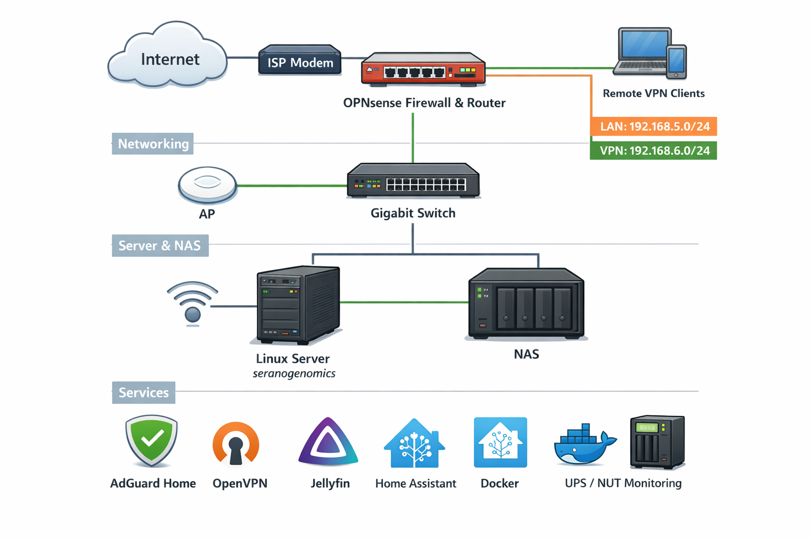

# Homelab Documentation

This repository documents my homelab architecture, services, troubleshooting, and operational notes. The lab is focused on practical networking, self-hosting, Linux administration, and reliability.

## Topology

## Environment Summary
Current environment includes:
- OPNsense router/firewall
- Main server: `seranogenomics`
- NAS: `nas`
- LAN: `192.168.5.0/24`
- OpenVPN subnet: `192.168.6.0/24`
- AdGuard Home + Unbound for DNS
- Docker/YAMS media stack
- Home Assistant
- UPS/NUT shutdown testing and recovery notes

## Goals
- build practical NetOps / sysadmin skills
- improve reliability and recovery workflows
- document troubleshooting and decisions clearly
- maintain a public portfolio of real homelab work

## Documentation
- [Network Topology](docs/network-topology.md)
- [Services](docs/services.md)
- [Incidents and Fixes](docs/incidents.md)
- [Roadmap](docs/roadmap.md)

## Current Focus
- VPN client internet access and routing behavior
- cleanup of stale DHCP/DNS mappings
- preboot/dropbear remote unlock networking
- NAS boot/power-loss behavior investigation
- eventual OpenVPN to WireGuard migration
